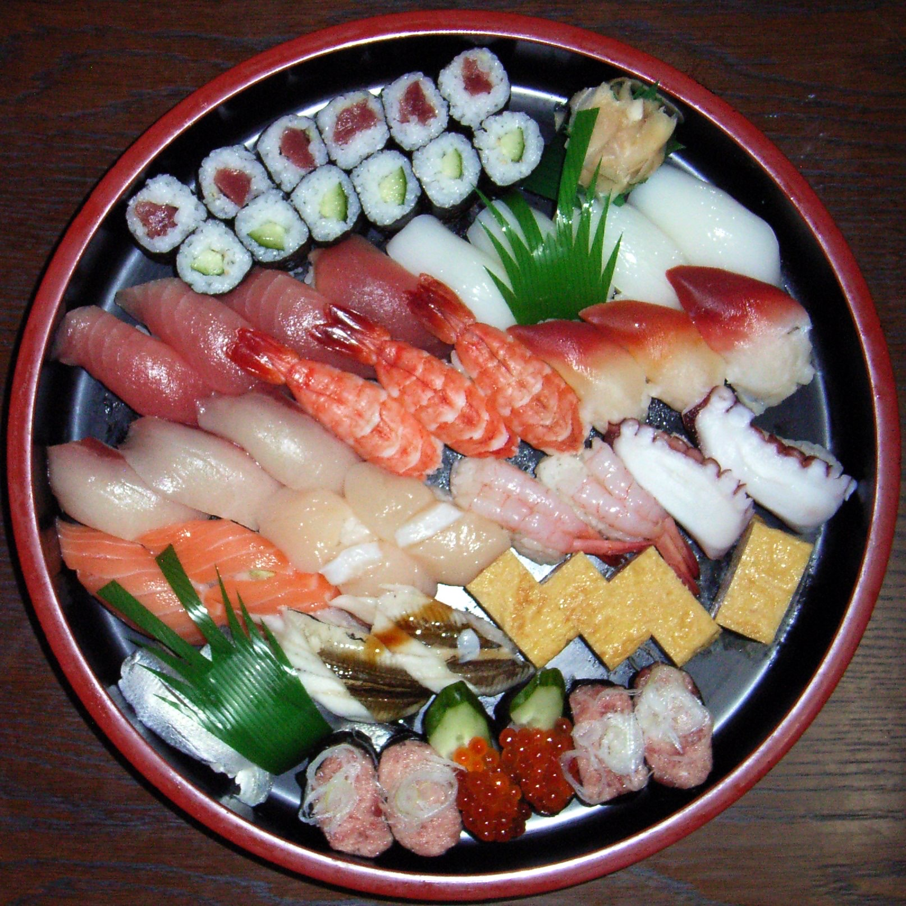
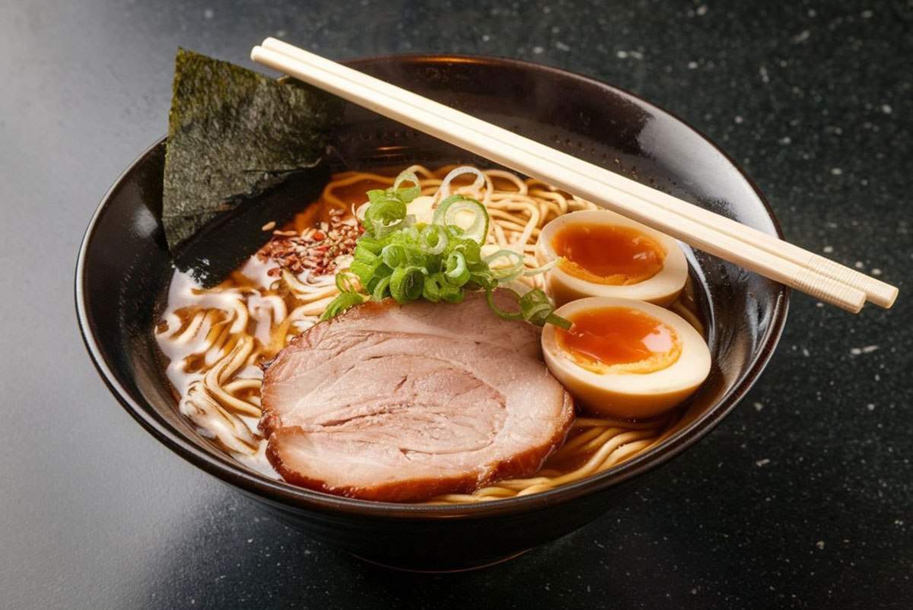
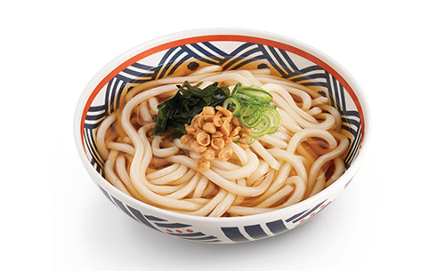

# 🇯🇵 일본 
일본은 전통과 현대가 조화를 이루는 독특한 문화를 가진 나라이다.

---

## 🍣 대표 음식 & 식문화

- 일본은 신선한 재료를 중요하게 생각한다.  
- 계절에 따라 다른 음식을 즐기는 문화가 있다. (제철 식재료, 음식)
- 음식을 먹기 전 "이타다키마스(いただきます)"라고 말한다. 
- 식사 후에는 "고치소사마데시타(ごちそうさまでした)"라고 감사 표현을 한다.
- 대표 음식으로는 다음과 같은 것이 있다.
- ### 스시 (Sushi)
  
- 신선한 생선과 식초로 간을 한 밥을 함께 먹는 일본 대표 음식. 재료의 신선도와 간결한 맛이 중요하다  
- ### 라멘 (Ramen)
  
- 진한 국물에 면을 넣어 먹는 일본식 국수 요리. 지역마다 국물 맛(간장, 된장, 돈코츠 등)이 다양하다  
- ### 우동 (Udon)
  
- 굵고 쫄깃한 면이 특징인 일본 전통 면 요리. 담백한 국물과 함께 즐기는 것이 일반적이다

---

## 🙇 인사 문화

- 일본은 예의를 매우 중요하게 여긴다.
- 인사할 때 고개를 숙이는 ‘오지기(お辞儀)’ 문화가 있다.
- 존댓말(경어)을 상황에 맞게 사용한다.

---

## 🏠 생활 문화

- 집에 들어갈 때 신발을 벗는 문화가 있다.
- 온천(温泉)과 목욕 문화가 발달해 있다.
- 대중교통 이용 시 통화나 큰 소리를 자제는 문화가 있다. 
- 쓰레기 분리수거를 매우 철저하게 한다.
- 편의점 문화가 발달하여 다양한 서비스를 제공한다. (택배 수령, 공과금 납부, ATM 인출, 복사/팩스, 티켓 예매 등)

---

## 🗣️ 일상 회화 표현

| 일본어 | 발음 | 한국어 |
|------|------|------|
| おはようございます | 오하요 고자이마스 | 안녕하세요 (아침)
| こんにちは | 곤니치와 | 안녕하세요 (낮/일반)
| こんばんは | 곤방와 | 안녕하세요 (저녁)
| おはようございます | 오하요 고자이마스 | 좋은 아침입니다
| ありがとうございます | 아리가토 고자이마스 | 감사합니다
| どういたしまして / お願いします | 도이타시마시테 / 오네가이시마스 | 천만에요 / 부탁합니다
| すみません | 스미마셍 | 죄송합니다
| お名前は何ですか | 오나마에와 난데스카 | 이름이 무엇입니까?
| 私の名前は__です | 와타시노 나마에와 __데스 | 제 이름은 __입니다
| お元気ですか | 오겐키데스카 | 어떻게 지내세요?
| 元気です | 겐키데스 | 잘 지냅니다
| さようなら | 사요나라 | 안녕히 가세요

---
