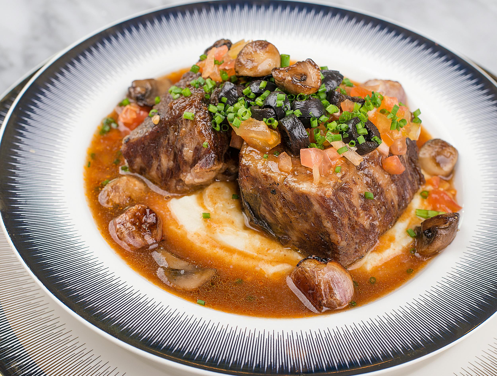
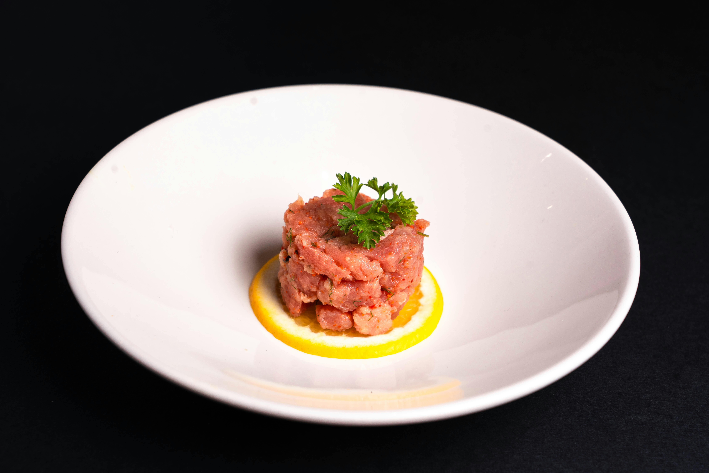

# 🇫🇷 프랑스  
프랑스는 유럽 서부에 위치한 나라로, 미식 문화와 예술, 그리고 일상 속 철학적 태도가 잘 드러나는 국가이다. 단순한 관광지를 넘어 ‘삶의 방식(Art de vivre)’을 중요하게 여기는 것이 특징이다.

---

## 🥖 대표 음식 & 식문화 
프랑스는 유네스코 무형문화유산으로 지정된 ‘프랑스인의 식사 문화(Le repas gastronomique des Français)’를 가진 나라이다. 이는 단순히 음식이 아니라 식사의 순서, 대화, 분위기까지 포함하는 문화이다. 

  
**뵈프 부르기뇽 (Boeuf Bourguignon)**   
소고기를 레드와인에 오랜 시간 동안 천천히 끓여 만드는 프랑스 전통 스튜 요리이다. 부르고뉴 지방에서 유래했으며, 질긴 고기를 부드럽게 만들기 위해 와인을 활용한 것이 특징이다. 프랑스 가정식의 대표적인 예로, 지역성과 전통이 잘 드러나는 음식이다. 

  
**타르타르 (Steak Tartare)**   
한국의 육회와 비슷한 음식으로, 잘게 다진 생고기에 계란 노른자, 향신료, 소스를 섞어 먹는 요리이다. 익히지 않은 고기를 사용한다는 점에서 프랑스 미식 문화의 ‘재료 본연의 맛’을 중시하는 특징을 보여준다. 위생과 재료의 신선도가 매우 중요한 음식이다. 한국의 육회와는 상큼한 맛, 즉 산미가 두드러진다. 

  
**그라탱 도피누아 (Gratin Dauphinois)**   
얇게 썬 감자를 크림과 함께 오븐에 구운 프랑스 전통 요리이다. 겉은 노릇하고 속은 부드러운 식감이 특징이며, 주로 사이드디시로 고기 요리와 함께 곁들여 먹는다. 단순한 재료로 깊은 맛을 내는 프랑스 요리의 특징을 잘 보여준다. 
- 식사는 보통 **전채(Entrée) → 본식(Plat) → 치즈 → 디저트** 순서
- 빵은 접시 위가 아니라 **테이블 위에 직접 놓고 먹는 문화**
- 와인은 단순한 술이 아니라 음식과의 ‘조화’를 중요하게 생각

---

## 🤝 인사 문화  프랑스의 인사 문화는 사회적 거리와 관계를 명확히 구분하는 특징이 있다. 
- 처음 만날 때는 **악수**를 하는 것이 일반적이다.
- 친한 사이에서는 **비즈(La bise)**라고 불리는 볼 인사를 한다.
- “Bonjour”는 단순한 인사가 아니라 **예의의 기본 요소**이다.
- 상점에 들어갈 때도 인사를 하지 않으면 무례하게 여겨질 수 있다.

👉 잘 안 알려진 특징
- 프랑스에서는 **존댓말(vous)과 반말(tu)** 구분이 매우 중요
- 관계가 가까워지기 전까지는 반드시 vous 사용
- 인사 없이 질문부터 하면 무례하게 인식됨

---

## 🏠 생활 문화 

프랑스는 개인의 삶과 여유를 중시하는 문화가 강한 나라이다. 

- 일과 삶의 균형을 중요하게 여긴다.  
- 점심시간이 길고, 식사를 천천히 즐기는 문화가 있다.  
- 일요일에는 대부분의 상점이 문을 닫는다.  
- 카페에서 오래 머무르며 대화를 나누는 문화가 발달했다.
- 한국과 비교해서 행정 절차가 정말정말 복잡하고 느린 편 (프랑스식 관료주의)  

---

## 💬 일상 회화 

프랑스어는 발음이 어렵지만, 기본 표현만으로도 충분한 의사소통이 가능하다. 

| 프랑스어 | 발음 | 한국어 |
|----------|------|--------|
| Bonjour | 봉주르 | 안녕하세요(낮) |
| Bonsoir | 봉수아ㅎ | 안녕하세요(밤) |
| Merci | 메르시 | 감사합니다 |
| Pardon | 빠흐동 | 실례합니다 / 죄송합니다 |
| S’il vous plaît | 실부플레 | 부탁합니다 |
| Combien ça coûte ? | 콩비앙 싸 쿠트 | 얼마인가요? |
| Où sont les toilettes ? | 우 쏭 레 뚜알렛 | 화장실 어디예요? |
| Je voudrais ___ | 쥬 부드레 | ___ 주세요 |
| Au revoir | 오 흐부아르 | 안녕히 가세요 |

🧔‍♂️ 현지인 표현들!  

🧔‍♂️ 현지인 표현들!   
- “Grave” : 완전 / 진짜로 / ㄹㅇ  
- “Ça va ?” : 잘 지내? (가볍게 안부 묻는 표현)  
- “D’accord” : 알겠어요 / ㅇㅋ
- Wesh 야 / 뭐야 (영어의 yo)

---
