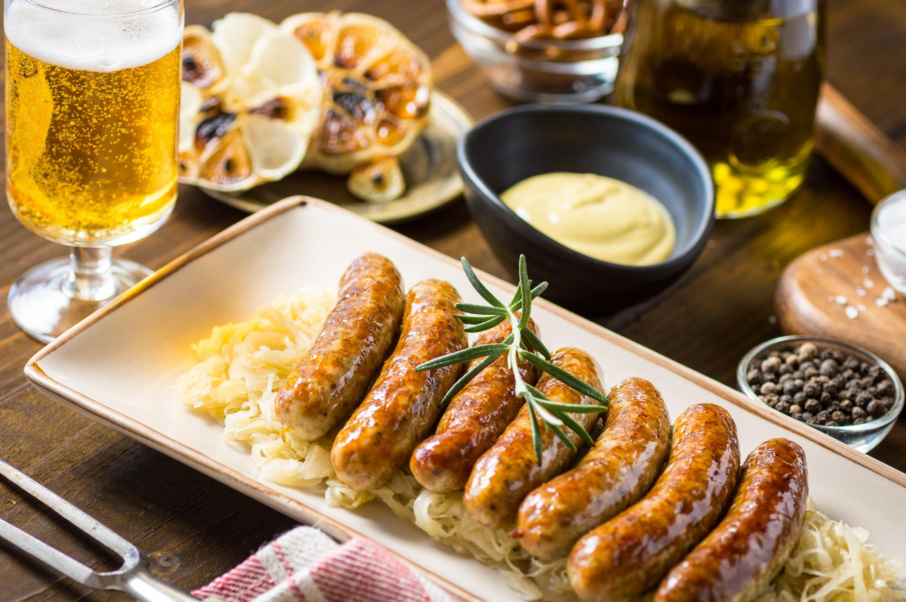
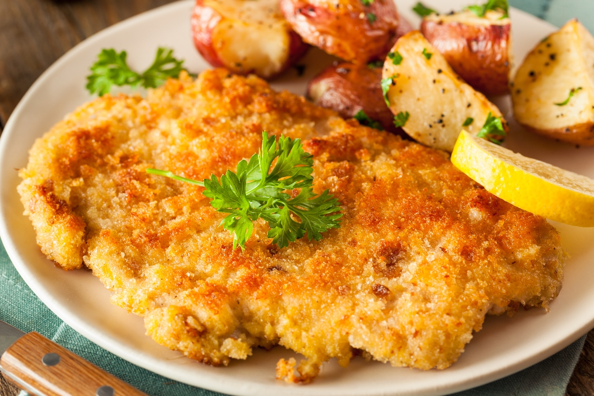
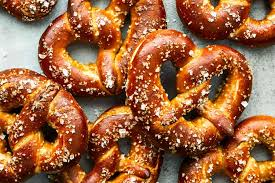

# 🇩🇪 독일
독일은 다양한 전통 음식과 맥주 문화, 그리고 규칙과 시간을 중요하게 생각하는 유럽의 강국 중 하나이다.

---

## 🥨 대표 음식 & 식문화

- 독일은 빵과 감자를 주식으로 먹는 나라이다.
- 아침에는 빵, 치즈, 햄 등을 먹는 경우가 많고 점심에는 고기 요리를 많이 먹는다.
- 저녁은 비교적 간단하게 먹는 편이다.  
- 독일은 맥주 문화가 발달한 나라로, 세계적으로 유명한 맥주 축제인 옥토버페스트(Oktoberfest)가 열리기도 한다.  
- 독일에서는 식사 시간과 약속 시간을 중요하게 생각하는 문화가 있다.
- 식사를 할 때에는 예절을 중요하게 생각하며, 식사 중 대화를 나누는 것을 중요하게 생각한다.

**Bratwurst** 
독일식 소시지로, 가장 유명한 독일 음식 중 하나

**Schnitzel** 
고기를 얇게 펴서 튀긴 요리

**Pretzel** 
고리 모양의 독일 전통 빵

---

## 🙇🏻‍♀️ 인사문화

- 독일에서는 처음 만났을 때 악수를 하는 것이 일반적인 인사 방법이다.
- 인사할 때는 간단한 악수와 함께 짧게 인사를 나누는 경우가 많다.
- 공식적인 자리에서는 이름이 아닌 성(Last name)을 사용하여 상대방을 부르는 경우가 많다.  
- 독일 사람들은 시간 약속을 매우 중요하게 생각하기 때문에 약속 시간에 늦지 않는 것이 중요하다.  
- 친하지 않은 사이에서는 지나친 스킨십을 피하는 것이 일반적이다.
- 친한 사이가 되면 이름을 부르며 편하게 대화하기도 한다.

---

## 🏠 생활문화

- 독일은 규칙을 잘 지키는 문화가 있는 나라이다.  
- 대중교통이 매우 잘 발달되어 있으며, 버스나 지하철을 많이 이용한다.  
- 자전거 이용도 활발하며 자전거 도로가 잘 마련되어 있다.
- 현금 사용이 아직도 많은 편이다.
- 또한 환경 보호를 중요하게 생각하여 분리수거를 철저하게 한다.  
- 독일은 일요일에는 대부분의 상점이 문을 닫기 때문에 미리 장을 보는 문화가 있다.  
- 개인의 사생활과 개인 시간을 중요하게 생각하는 문화도 있다.

---

## 🗣️ 일상회화

| 독일어 | 한국어 | 발음 |
|--------|--------|------|
| Hallo | 안녕하세요 | 할로 |
| Guten Morgen | 좋은 아침입니다 | 구텐 모르겐 |
| Guten Tag | 안녕하세요 | 구텐 탁 |
| Danke | 감사합니다 | 당케 |
| Bitte | 천만에요 / 부탁합니다 | 비테 |
| Entschuldigung | 죄송합니다 / 실례합니다 | 엔트슐디궁 |
| Wie heißen Sie? | 이름이 무엇입니까? | 비 하이센 지? |
| Ich heiße ___ | 제 이름은 ___ 입니다 | 이히 하이세 ___ |
| Wie geht's? | 어떻게 지내세요? | 비 게이츠? |
| Gut | 잘 지냅니다 | 구트 |
| Tschüss | 안녕히 가세요 | 츄스 |
| Ich hätte gern ein Brot und einen Kaffee, bitte. | 빵 하나와 커피 하나 주세요. | 이히 헤테 게른 아인 브로트 운트 아이넨 카페, 비테 |
| Entschuldigung, wo ist die nächste U-Bahn-Station? | 실례합니다, 가장 가까운 지하철역이 어디인가요? | 엔트슐디궁, 보 이스트 디 넥스테 우반-슈타치온? |
---

