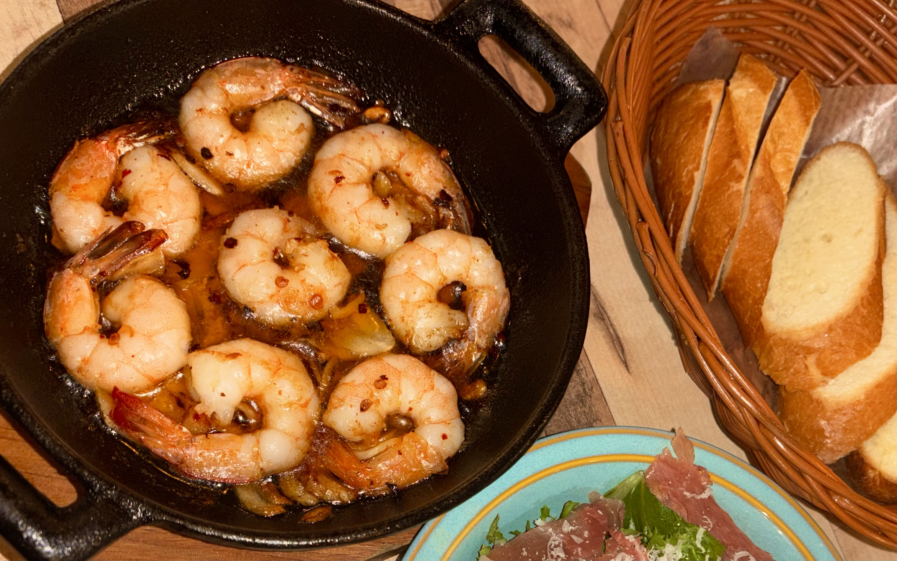
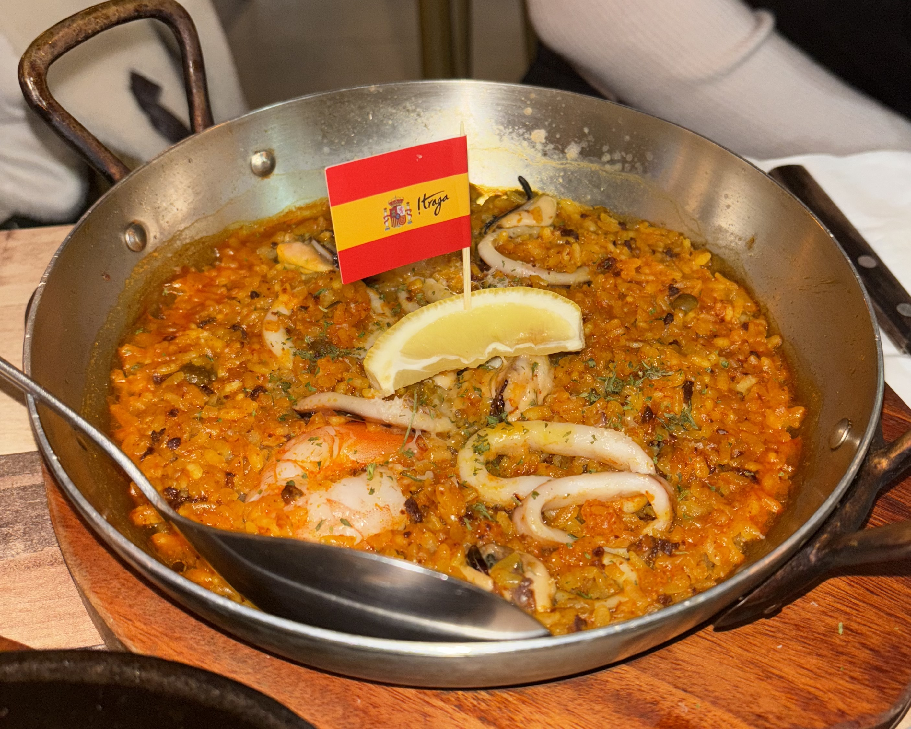

## 스페인 대표 음식&식문화 
스페인 식문화는 신선한 제철 식재료와 올리브유를 듬뿍 사용하는 지중해식 식단이 핵심이다. 하루 다섯 번의 식사를 즐기며, 특히 늦은 오후와 밤에 걸쳐  긴 시간 동안 대화하며 식사하는 것을 선호한다. 다음은 스페인 대표 음식이다. 
  
**감바스 알 아히요** 
새우와 마늘을 올리브유에 넣고 낮은 온도에서 끓이듯 익혀낸 스페인의 대표 요리이다. 지중해식 식단의 핵심인 신선한 올리브유의 풍미에 마늘의 향과 페페론치노의 매콤함이 어우러진 것이 특징이다. 스페인 전역의 바에서 즐겨 먹으며, 남은 오일에 빵을 적셔 먹는 방식이다. 

**파에야** 
파에야는 넓은 팬에 쌀, 해산물, 고기, 채소를 넣고 볶은 스페인 전통 쌀 요리이다. 지중해 연안의 발렌시아 지방에서 유래했으며, 샤프란을 사용하여 특유의 노란 빛깔과 향을 내는 것이 특징이다. 스페인의 가족이나 친구들이 모이는 주말 식탁에 빠지지 않는 대표적인 사교 음식이다.

---

## 스페인 인사 문화 
스페인의 인사문화는 비교적 친근하고 따뜻한 편이다. 처음 만날 때는 가벼운 악수를 하며, 친한 사이에서는 양쪽 볼에 가볍게 입맞춤을 하기도 한다.  인사할 때는 눈을 맞추고 밝은 표정을 유지하는 것이 중요하며, "Hola(올라)" 같은 간단한 인사를 자주 사용한다. 시간에 따라 아침에는 "Buenos días(부에노스 디아스)", 오후에는 "Buenas tardes(부에나스 타르데스)", 밤에는 "Buenas noches(부에나스 노체스)" 등으로 구분해 인사하는 것도 특징이다.  또한 스페인에서는 상대방과 눈을 마주치고 인사하는 것이 예의로 여겨지며, 밝은 표정과 함께 인사를 나눈다.

---

## 스페인 생활 문화 
스페인은 여유로운 생활 문화를 가진 나라로, 식사 시간이 다른 나라에 비해 늦은 편이라는 특징이 있다. 일반적으로 점심은 14시 이후, 저녁은 21시 이후에 시작하는 경우가 많다. 스페인 중부에서는 점심 이후 '시에스타'라고 불리는 낮잠 시간을 가지는 전통이 남아 있는데, 이는 여름에 강한 햇빛으로 인한 일사병을 방지하자는 취지에서 시행된 것이다. 이로 인해 13시~17시 사이에는 거의 모든 상점과 음식점, 관공서까지 문을 닫기 때문에 여행자들은 주의해야 한다. 또한, 퇴근 후나 주말에는 집보다 광장(Plaza)이나 바(Bar)에 모여 가벼운 안주인 타파스(Tapas)를 곁들여 대화하는 것을 선호한다. 모르는 사람과도 쉽게 어울리는 개방적인 성격과 축제를 사랑하는 문화 덕분에 거리 곳곳에는 늘 활기찬 에너지가 넘친다.

---

## 스페인 일상 회화 
스페인어는 비교적 간단한 표현만으로도 기본적인 의사소통이 가능한 언어이다. 특히 인사말과 간단한 질문 표현만 익혀도 식당이나 상점, 관광지에서 큰 어려움 없이 소통할 수 있다.  다음과 같은 문장들은 여행 상황에서 매우 유용하게 활용된다.

-Hola(올라) : 안녕하세요. 
-Gracias(그라시아스) : 감사합니다. 
-lo  siento(로 시엔또) : 죄송합니다. 
-¿Cuánto cuesta?(꽌또 꾸에스타) : 얼마예요? 
-¿Dónde está el baño?(돈데 에스타 엘 바뇨) : 화장실이 어디예요? 
-Lléveme aquí(예베메 아끼) : 여기로 가주세요. 
